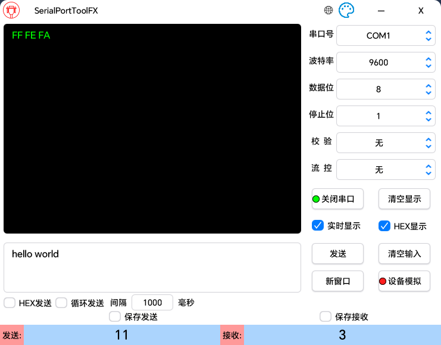
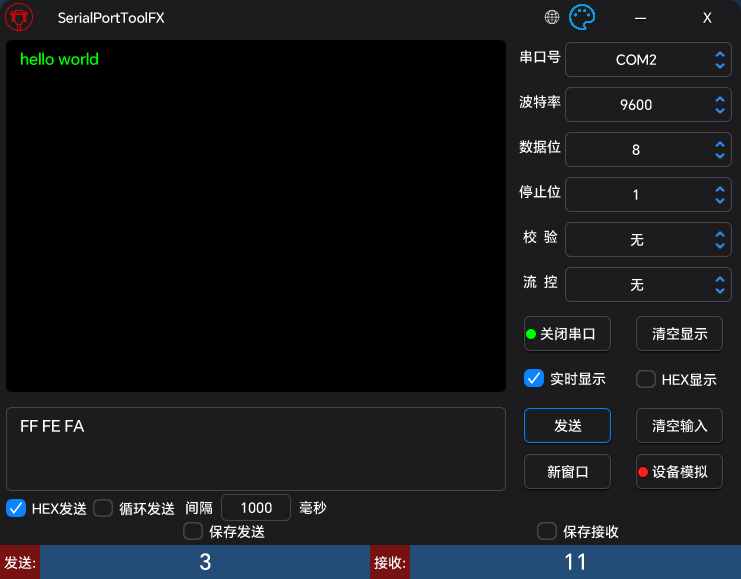

# SerialPortToolFX

- [**日本語**](README_JP.md) | [**English**](README_EN.md)

## 概述

SerialPortToolFX 是一款功能强大的跨平台开源串口调试工具，基于 JavaFX 开发。专为嵌入式开发、硬件调试和串口通信测试而设计，提供直观易用的图形界面和丰富的调试功能。支持中文、英文、日文三种语言界面，满足不同地区开发者的使用需求。

## 软件界面

### 亮色主题



### 暗色主题



## 功能特性

- **智能串口检测**：实时自动检测并显示系统中所有可用的串口设备，支持热插拔识别
- **双格式数据处理**：完整支持 ASCII 文本和 HEX 十六进制格式的数据收发，满足不同应用场景
- **精确数据统计**：实时统计收发数据的字节数，便于性能分析和调试验证（点击数字即可快速清零）
- **可靠数据记录**：支持将串口通信数据完整保存到本地文件，便于后续分析和问题追踪
- **高效多窗口操作**：支持同时打开多个独立的串口调试窗口，可并行调试多个设备
- **智能设备模拟**：通过 JSON 配置文件实现设备模拟功能，可根据接收数据自动发送预设回复，极大提升调试效率
- **完善国际化支持**：内置中文、英文、日文界面，根据系统语言自动适配
- **性能优化设计**：针对长时间大数据量测试进行优化，有效避免界面卡顿问题

## 依赖

- [lombok](https://github.com/projectlombok/lombok)
- [javafx](https://github.com/openjdk/jfx)
- [atlantafx](https://github.com/mkpaz/atlantafx)
- [jSerialComm](https://github.com/Fazecast/jSerialComm)
- [gson](https://github.com/google/gson)
- [commons-codec](https://github.com/apache/commons-codec)
- [commons-text](https://github.com/apache/commons-text)

## 设备模拟配置说明

设备模拟功能允许程序模拟成一个串口设备，当接收到特定数据时自动发送预设的回复。这对于测试上位机软件或模拟硬件设备响应非常有用。

### 配置文件结构

JSON配置文件包含三个核心部分：
- **基础配置**：定义数据编码格式和消息边界识别方式
- **模拟规则**：定义接收数据与回复数据的对应关系

### 基础配置参数

#### 1. encode（编码格式）
- **作用**：指定配置文件中数据的编码格式
- **可选值**：`"HEX"` 或 `"ASCII"`（不区分大小写）
- **说明**：
  - `"HEX"`：配置中的数据按十六进制格式解析（如：`"01 02 03"`）
  - `"ASCII"`：配置中的数据按ASCII文本格式解析（如：`"Hello"`）

#### 2. 消息边界识别（二选一）

**方式一：packSize（固定长度）**
- **作用**：根据数据包固定长度判断消息完整性
- **格式**：数字字符串（如：`"8"`表示8字节长度）
- **适用场景**：协议中数据包长度固定的情况

**方式二：delimiter（分隔符）**
- **作用**：根据特定分隔符判断消息完整性
- **格式**：
  - ASCII模式：直接输入分隔符（如：`"\r\n"`表示回车换行）
  - HEX模式：十六进制格式（如：`"0D 0A"`表示回车换行）
- **适用场景**：协议中使用特定结束符的情况

**重要规则**：
- `packSize` 和 `delimiter` 必须指定其中一个，不能都为空
- 如果同时指定，优先使用 `packSize`（除非 `packSize` 格式错误）

### 模拟规则配置

在基础配置之外，添加 `"接收数据": "回复数据"` 的键值对来定义模拟规则：

```json
{
  "encode": "HEX",
  "packSize": "4",
  "delimiter": "",
  "01 02 03 04": "05 06 07 08",
  "AA BB CC DD": "11 22 33 44"
}
```

### 配置注意事项

1. **数据格式一致性**：所有数据必须与 `encode` 参数指定的格式一致
2. **分隔符冲突**：使用 `delimiter` 时，避免在数据内容中包含相同的分隔符
3. **字符串类型**：JSON中所有键值都必须是字符串格式
4. **单层结构**：不支持嵌套的JSON结构

### 配置示例

#### 示例1：ASCII文本 + 固定长度
**场景**：模拟接收5字节ASCII命令并回复
```json
{
  "encode": "ASCII",
  "packSize": "5",
  "delimiter": "",
  "HELLO": "WORLD",
  "START": "OK...",
  "RESET": "DONE."
}
```
**说明**：当接收到5字节的"HELLO"时，自动回复"WORLD"

#### 示例2：ASCII文本 + 换行符结束
**场景**：模拟AT命令响应
```json
{
  "encode": "ASCII",
  "packSize": "",
  "delimiter": "\r\n",
  "AT\r\n": "OK\r\n",
  "AT+VERSION\r\n": "V1.0.0\r\n",
  "AT+RESET\r\n": "RESETTING...\r\n"
}
```
**说明**：接收以\r\n结尾的AT命令，返回对应响应

#### 示例3：十六进制 + 固定长度
**场景**：模拟Modbus RTU设备
```json
{
  "encode": "HEX",
  "packSize": "8",
  "delimiter": "",
  "01 03 00 00 00 01 84 0A": "01 03 02 00 64 B8 FA",
  "01 06 00 00 00 64 C9 DB": "01 06 00 00 00 64 C9 DB"
}
```
**说明**：模拟Modbus读取和写入操作的响应

#### 示例4：十六进制 + 自定义结束符
**场景**：自定义协议，以特定字节序列结束
```json
{
  "encode": "HEX",
  "packSize": "",
  "delimiter": "0D 0A",
  "AA BB 01 0D 0A": "AA BB 81 0D 0A",
  "AA BB 02 0D 0A": "AA BB 82 0D 0A"
}
```
**说明**：接收以0D 0A（回车换行）结尾的十六进制数据包

### 使用步骤

1. **创建配置文件**：根据需要模拟的设备协议创建JSON文件
2. **加载配置**：在软件中点击"设备模拟"按钮，选择配置文件
3. **验证加载**：观察指示灯状态（🟢成功 / 🔴失败）
4. **开始测试**：配置加载成功后，程序将根据配置自动回复

## 编译打包

### 环境要求

- Java 22+
- Gradle 8.0+
- 支持的操作系统：Windows 10+, macOS 10.14+, Linux (Ubuntu 18.04+)

### 执行指令

```bash
# 清理构建目录
gradle clean

# 构建应用程序
gradle build

# 创建可分发的应用程序镜像
gradle jpackageImage

# 创建安装程序（可选）
gradle jpackage
```

## 使用说明

### 界面布局

#### 顶部控制栏
- **🌐 语言切换**：点击地球图标切换中文/英文/日文界面
- **🎨 主题切换**：点击主题图标切换亮色/暗色主题
- **— 最小化**：最小化窗口
- **X 关闭**：关闭应用程序

#### 串口参数配置区（右侧）
- **串口号**：选择要连接的串口设备
- **波特率**：设置通信速率（9600, 115200等）
- **数据位**：设置数据位数（通常为8位）
- **停止位**：设置停止位（1, 1.5, 2）
- **校验**：设置校验方式（无、奇校验、偶校验等）
- **流控**：设置流量控制方式

#### 串口控制按钮
- **打开串口/关闭串口**：连接或断开选定的串口设备
  - 🟢 绿灯：串口已连接
  - 🔴 红灯：串口未连接
- **清空显示**：清除接收区域显示的所有数据
- **发送**：将发送区的数据通过串口发送出去
- **清空输入**：清除发送区域的用户输入内容
- **新窗口**：创建一个新的串口调试窗口（复制当前配置）
- **设备模拟**：加载JSON配置文件，模拟串口设备自动回复
  - 🟢 绿灯：配置加载成功
  - 🔴 红灯：配置加载失败

#### 数据显示与输入区（左侧）
- **接收区域**：显示从串口接收到的数据
- **发送区域**：输入要发送的数据

#### 功能选项
- **实时显示**：勾选后接收数据时实时在显示区显示，取消勾选则只计数不显示。为防止长时间大数据量测试时软件卡死（市面上大多数串口助手都存在此问题），建议在高频数据传输时关闭此选项
- **HEX显示**：将接收到的数据以十六进制格式显示，便于查看二进制数据内容
- **HEX发送**：将输入的数据按十六进制格式解析后发送，注意必须输入正确的十六进制格式（如：01 02 03 或 010203）
- **循环发送**：周期性自动发送数据
  - **间隔**：设置发送间隔时间（毫秒）
- **保存接收**：将接收到的数据保存到本地文件
- **保存发送**：将发送出去的数据保存到本地文件

#### 数据统计（底部）
- **发送计数**：显示已发送的字节数（点击数字可清零）
- **接收计数**：显示已接收的字节数（点击数字可清零）

### 基本操作流程

1. **配置串口参数**：选择串口号、波特率等参数
2. **打开串口**：点击"打开串口"按钮连接设备
3. **发送数据**：在发送区输入数据，点击"发送"按钮
4. **查看接收**：在接收区查看设备返回的数据
5. **关闭串口**：使用完毕后点击"关闭串口"断开连接

### 高级功能

#### 设备模拟功能
通过加载JSON配置文件，程序可以模拟各种串口设备的行为。当接收到配置中定义的特定数据时，会自动发送对应的回复数据。这个功能特别适用于：
- **上位机软件测试**：无需真实硬件即可测试软件功能
- **协议验证**：验证通信协议的正确性
- **自动化测试**：构建自动化测试环境
- **设备仿真**：模拟各种设备响应行为

#### 多窗口支持
点击"新窗口"可以创建多个独立的串口调试窗口，每个窗口可以连接不同的串口设备，提高调试效率。

#### 数据持久化
勾选"保存接收"或"保存发送"可以将通信数据自动保存到本地文件，便于后续分析和记录。

## 开发环境设置

1. 克隆项目：`git clone https://github.com/yiaobang/SerialPortToolFX.git`
2. 进入项目目录：`cd SerialPortToolFX`
3. 运行应用：`gradle run`