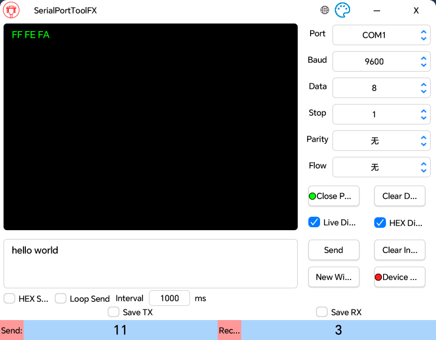
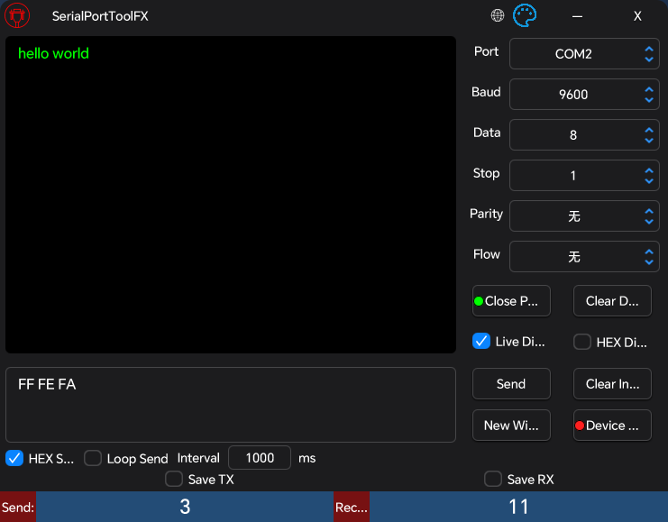

# SerialPortToolFX

- [**日本語**](README_JP.md) | [**简体中文**](README.md)

## Overview

SerialPortToolFX is a powerful cross-platform open-source serial port debugging tool built with JavaFX. Specifically designed for embedded development, hardware debugging, and serial communication testing, it provides an intuitive graphical interface with rich debugging features. Supporting Chinese, English, and Japanese interfaces to meet the needs of developers from different regions.

## Software Interface

### Light Theme



### Dark Theme



## Features

- **Smart Port Detection**: Real-time automatic detection and display of all available serial port devices in the system, with hot-plug recognition support
- **Dual Format Data Processing**: Complete support for both ASCII text and HEX hexadecimal format data transmission, meeting different application scenarios
- **Precise Data Statistics**: Real-time tracking of sent and received data byte counts for performance analysis and debugging verification (click numbers for quick reset)
- **Reliable Data Logging**: Support for saving complete serial communication data to local files for subsequent analysis and issue tracking
- **Efficient Multi-Window Operation**: Support for opening multiple independent serial debugging windows simultaneously, enabling parallel debugging of multiple devices
- **Intelligent Device Simulation**: Implement device simulation through JSON configuration files, automatically sending preset replies based on received data, greatly improving debugging efficiency
- **Comprehensive Internationalization**: Built-in Chinese, English, and Japanese interfaces, automatically adapting based on system language
- **Performance Optimized Design**: Optimized for long-term high-volume data testing to effectively prevent interface freezing issues

## Dependencies

- [lombok](https://github.com/projectlombok/lombok)
- [javafx](https://github.com/openjdk/jfx)
- [atlantafx](https://github.com/mkpaz/atlantafx)
- [jSerialComm](https://github.com/Fazecast/jSerialComm)
- [gson](https://github.com/google/gson)
- [commons-codec](https://github.com/apache/commons-codec)
- [commons-text](https://github.com/apache/commons-text)

## Device Simulation Configuration

The device simulation feature allows the program to simulate a serial port device, automatically sending preset replies when receiving specific data. This is extremely useful for testing host software or simulating hardware device responses.

### Configuration File Structure

The JSON configuration file contains three core parts:
- **Basic Configuration**: Defines data encoding format and message boundary recognition method
- **Simulation Rules**: Defines the correspondence between received data and reply data

### Basic Configuration Parameters

#### 1. encode (Encoding Format)
- **Purpose**: Specifies the data encoding format in the configuration file
- **Options**: `"HEX"` or `"ASCII"` (case-insensitive)
- **Description**:
  - `"HEX"`: Data in configuration is parsed as hexadecimal format (e.g., `"01 02 03"`)
  - `"ASCII"`: Data in configuration is parsed as ASCII text format (e.g., `"Hello"`)

#### 2. Message Boundary Recognition (Choose One)

**Method 1: packSize (Fixed Length)**
- **Purpose**: Determine message completeness based on fixed data packet length
- **Format**: Numeric string (e.g., `"8"` means 8 bytes length)
- **Use Case**: When protocol has fixed-length data packets

**Method 2: delimiter (Delimiter)**
- **Purpose**: Determine message completeness based on specific delimiter
- **Format**:
  - ASCII mode: Direct input of delimiter (e.g., `"\r\n"` for carriage return + line feed)
  - HEX mode: Hexadecimal format (e.g., `"0D 0A"` for carriage return + line feed)
- **Use Case**: When protocol uses specific terminators

**Important Rules**:
- Either `packSize` or `delimiter` must be specified, cannot both be empty
- If both are specified, `packSize` takes priority (unless `packSize` format is incorrect)

### Simulation Rules Configuration

Beyond basic configuration, add `"received_data": "reply_data"` key-value pairs to define simulation rules:

```json
{
  "encode": "HEX",
  "packSize": "4",
  "delimiter": "",
  "01 02 03 04": "05 06 07 08",
  "AA BB CC DD": "11 22 33 44"
}
```

### Configuration Guidelines

1. **Data Format Consistency**: All data must match the format specified by the `encode` parameter
2. **Delimiter Conflicts**: When using `delimiter`, avoid including the same delimiter in data content
3. **String Types**: All keys and values in JSON must be string format
4. **Single-Level Structure**: Nested JSON structures are not supported

### Configuration Examples

#### Example 1: ASCII Text + Fixed Length
**Scenario**: Simulate receiving 5-byte ASCII commands and replying
```json
{
  "encode": "ASCII",
  "packSize": "5",
  "delimiter": "",
  "HELLO": "WORLD",
  "START": "OK...",
  "RESET": "DONE."
}
```
**Description**: When receiving 5-byte "HELLO", automatically reply "WORLD"

#### Example 2: ASCII Text + Line Feed Terminator
**Scenario**: Simulate AT command responses
```json
{
  "encode": "ASCII",
  "packSize": "",
  "delimiter": "\r\n",
  "AT\r\n": "OK\r\n",
  "AT+VERSION\r\n": "V1.0.0\r\n",
  "AT+RESET\r\n": "RESETTING...\r\n"
}
```
**Description**: Receive AT commands ending with \r\n, return corresponding responses

#### Example 3: Hexadecimal + Fixed Length
**Scenario**: Simulate Modbus RTU device
```json
{
  "encode": "HEX",
  "packSize": "8",
  "delimiter": "",
  "01 03 00 00 00 01 84 0A": "01 03 02 00 64 B8 FA",
  "01 06 00 00 00 64 C9 DB": "01 06 00 00 00 64 C9 DB"
}
```
**Description**: Simulate Modbus read and write operation responses

#### Example 4: Hexadecimal + Custom Terminator
**Scenario**: Custom protocol ending with specific byte sequence
```json
{
  "encode": "HEX",
  "packSize": "",
  "delimiter": "0D 0A",
  "AA BB 01 0D 0A": "AA BB 81 0D 0A",
  "AA BB 02 0D 0A": "AA BB 82 0D 0A"
}
```
**Description**: Receive hexadecimal data packets ending with 0D 0A (carriage return + line feed)

### Usage Steps

1. **Create Configuration File**: Create JSON file based on the device protocol to simulate
2. **Load Configuration**: Click "Device Mock" button in software, select configuration file
3. **Verify Loading**: Observe indicator light status (🟢 Success / 🔴 Failed)
4. **Start Testing**: After successful configuration loading, program will automatically reply according to configuration

## Build and Package

### Environment Requirements

- Java 22+
- Gradle 8.0+
- Supported OS: Windows 10+, macOS 10.14+, Linux (Ubuntu 18.04+)

### Commands

```bash
# Clean build directory
gradle clean

# Build application
gradle build

# Create distributable application image
gradle jpackageImage

# Create installer (optional)
gradle jpackage
```

## Usage Guide

### Interface Layout

#### Top Control Bar
- **🌐 Language Switch**: Click globe icon to switch between Chinese/English/Japanese interface
- **🎨 Theme Switch**: Click theme icon to switch between light/dark themes
- **— Minimize**: Minimize window
- **X Close**: Close application

#### Serial Port Configuration Area (Right Side)
- **Port**: Select the serial port device to connect
- **Baud**: Set communication speed (9600, 115200, etc.)
- **Data**: Set data bits (usually 8 bits)
- **Stop**: Set stop bits (1, 1.5, 2)
- **Parity**: Set parity check method (None, Odd, Even, etc.)
- **Flow**: Set flow control method

#### Serial Port Control Buttons
- **Open Port/Close Port**: Connect or disconnect the selected serial port device
  - 🟢 Green light: Port connected
  - 🔴 Red light: Port disconnected
- **Clear Display**: Clear all data displayed in the receive area
- **Send**: Send data from the send area through the serial port
- **Clear Input**: Clear user input content in the send area
- **New Window**: Create a new serial port debugging window (copy current configuration)
- **Device Mock**: Load JSON configuration file to simulate serial device auto-reply
  - 🟢 Green light: Configuration loaded successfully
  - 🔴 Red light: Configuration loading failed

#### Data Display and Input Area (Left Side)
- **Receive Area**: Display data received from the serial port
- **Send Area**: Input data to be sent

#### Function Options
- **Live Display**: When checked, received data is displayed in real-time; when unchecked, only counts without display. To prevent software freezing during long-term high-volume data testing (a common issue with most serial assistants on the market), it's recommended to disable this option during high-frequency data transmission
- **HEX Display**: Display received data in hexadecimal format for easy viewing of binary data content
- **HEX Send**: Parse input data as hexadecimal format before sending. Note: Must input correct hexadecimal format (e.g., 01 02 03 or 010203)
- **Loop Send**: Periodically send data automatically
  - **Interval**: Set sending interval time (milliseconds)
- **Save RX**: Save received data to local file
- **Save TX**: Save sent data to local file

#### Data Statistics (Bottom)
- **Send Count**: Display number of bytes sent (click number to reset)
- **Receive Count**: Display number of bytes received (click number to reset)

### Basic Operation Flow

1. **Configure Serial Parameters**: Select port number, baud rate, and other parameters
2. **Open Port**: Click "Open Port" button to connect device
3. **Send Data**: Input data in send area and click "Send" button
4. **View Received Data**: Check device response in receive area
5. **Close Port**: Click "Close Port" to disconnect when finished

### Advanced Features

#### Device Simulation Function
By loading JSON configuration files, the program can simulate various serial port device behaviors. When receiving specific data defined in the configuration, it automatically sends corresponding reply data. This feature is particularly useful for:
- **Host Software Testing**: Test software functionality without real hardware
- **Protocol Verification**: Verify communication protocol correctness
- **Automated Testing**: Build automated testing environments
- **Device Emulation**: Simulate various device response behaviors

#### Multi-Window Support
Click "New Window" to create multiple independent serial port debugging windows, each can connect to different serial port devices, improving debugging efficiency.

#### Data Persistence
Check "Save RX" or "Save TX" to automatically save communication data to local files for subsequent analysis and recording.

## Development Setup

1. Clone the project: `git clone https://github.com/yiaobang/SerialPortToolFX.git`
2. Navigate to project directory: `cd SerialPortToolFX`
3. Run the application: `gradle run`