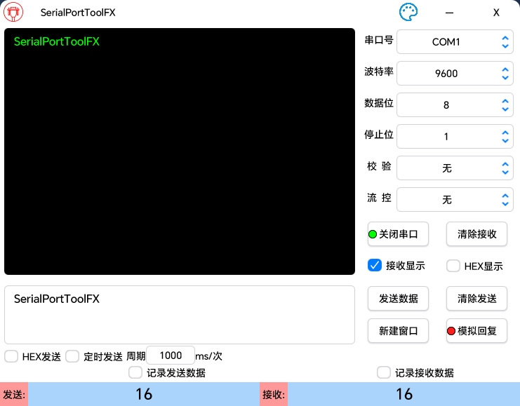
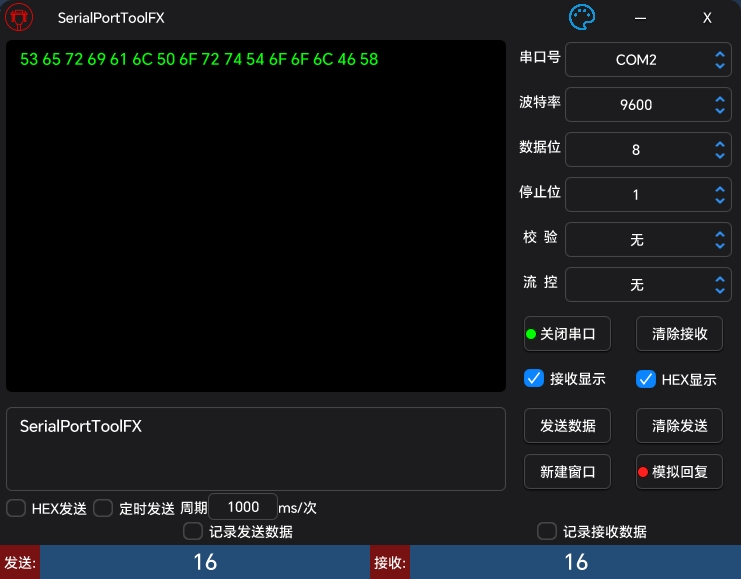

# SerialPortToolFX

- [**English(Use Copilot to translate)**](README_EN.md) | [**简体中文**](README.md)

## 概要

SerialPortToolFX は、JavaFX を使用して構築されたクロスプラットフォームのオープンソースシリアルポートデバッグツールです。開発者がシリアルポート通信をデバッグおよび管理しやすくするために、ユーザーフレンドリーなインターフェースを提供します。

## ソフトウェアのインターフェース

### ライトテーマ



### ダークテーマ



## 機能特性

- **リアルタイムシリアルポートリストの更新**：利用可能なシリアルポートデバイスを自動検出して表示します。
- **データフォーマットサポート**：ASCII および HEX 形式のシリアルデータ送受信をサポートします。
- **データ統計**：送受信データのバイト数を統計し、分析を容易にします。（カウントをリセットするには、対応する数字をクリックしてください）
- **データ永続化**：シリアル通信データをファイルに保存できます。（対応するオプションボタンを選択する必要があります）
- **複数ウィンドウのサポート**：複数のシリアル通信ウィンドウを同時に開くことができます。
- **シミュレーション応答**：指定されたデータを受信した際に、事前設定されたデータを応答として送信します。（正しく構成された JSON ファイルを読み込む必要があります）

## 依存関係

- [lombok](https://github.com/projectlombok/lombok)
- [javafx](https://github.com/openjdk/jfx)
- [atlantafx](https://github.com/mkpaz/atlantafx)
- [jSerialComm](https://github.com/Fazecast/jSerialComm)
- [gson](https://github.com/google/gson)
- [commons-codec](https://github.com/apache/commons-codec)
- [commons-text](https://github.com/apache/commons-text)

## シリアルポートシミュレーション応答 JSON ファイル説明

### JSON 基本設定例：

```json
{
  "encode": "HEX",
  "packSize": "13",
  "delimiter": ""
}
```

### JSON ファイル設定要件と説明：

1. JSON のキーと値はすべて文字列型である必要があります。
2. JSON は 1 階層のみで、多階層は許可されません。
3. JSON 内の encode はエンコード形式を示します。
    - 現在選択可能な値（大文字小文字は区別されません）： **HEX  ASCII**
    - encode に HEX を指定した場合、以下のキーと値は 16 進数でデコードされます。
    - encode に ASCII を指定した場合、以下のキーと値は ASCII でデコードされます。
4. JSON 内の packSize と delimiter は、シリアルメッセージの完全性を判断する方法を指定します。
    - packSize はデータパケットの長さで完全性を判断します。
    - delimiter は特定の記号で完全性を判断します。
    - **packSize と delimiter の両方が指定された場合、packSize が不正（非数値）の場合を除き、delimiter は無視されます。**
    - **packSize と delimiter の両方を空にすることはできません。**
5. シリアル終了記号を判断基準として使用する場合、内容中に終了記号が含まれないようにするのが望ましいです。そうしないとシミュレーション応答機能が無効になります。


### 以下は JSON ファイルの設定例：

1. ASCII + データパケットサイズ

   ```json
   {
     "encode": "ASCII",
     "packSize": "5",
     "delimiter": "",
     "abcde":"ABCDE",
      "12345":"12345"
   }
   ```

2. ASCII + 終了記号

   ```json
   {
     "encode": "ASCII",
     "packSize": "",
     "delimiter": "\r\n",
     "A\r\n":"B\r\n",
      "AAAA\r\n":"BAAA\r\n"
   }
   ```

3. HEX + データパケットサイズ

   ```json
   {
     "encode": "HEX",
     "packSize": "5",
     "delimiter": "",
     "F1 F2 F3 F4 F5":"01 02 03 04 05",
     "F0 F2 F3 F4 F5":"01 02 03 04 05"
   }
   ```

4. HEX + 終了記号

   ```json
   {
     "encode": "HEX",
     "packSize": "",
     "delimiter": "0D 0A",
     "01 02 0D 0A":"01 02 0D 0A",
     "01 03 0D 0A":"01 03 05 0D 0A"
   }
   ```
   
   ## コンパイルとパッケージ
   
   ### 環境要件
   
   - java22+
   - Gradle（対応する Java バージョン）
   
   ### 実行コマンド
   
   ```powershell
   gradle clean
   gradle jpackageimage
   ```
   
   

