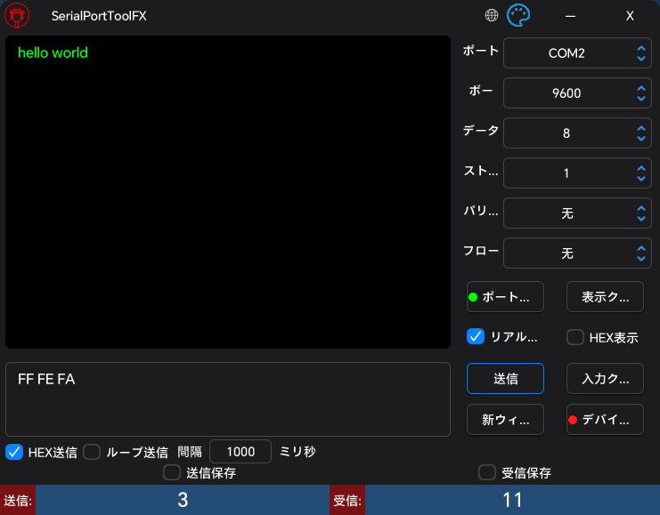

# SerialPortToolFX

- [**English**](README_EN.md) | [**简体中文**](README.md)

## 概要

SerialPortToolFX は、JavaFX で開発された機能豊富なクロスプラットフォームオープンソースシリアルポートデバッグツールです。組み込み開発、ハードウェアデバッグ、シリアル通信テストのために特別に設計され、直観的で使いやすいグラフィカルインターフェースと豊富なデバッグ機能を提供します。中国語、英語、日本語のインターフェースをサポートし、異なる地域の開発者のニーズに対応しています。

## ソフトウェアのインターフェース

### ライトテーマ


### ダークテーマ



## 機能特性

- **スマートポート検出**: システム内のすべての利用可能なシリアルポートデバイスをリアルタイムで自動検出・表示、ホットプラグ認識をサポート
- **デュアルフォーマットデータ処理**: ASCIIテキストとHEX十六進数形式のデータ送受信を完全サポート、異なるアプリケーションシナリオに対応
- **精密データ統計**: 送受信データのバイト数をリアルタイムで追跡、パフォーマンス分析とデバッグ検証に便利（数字クリックで簡単リセット）
- **信頼性の高いデータ記録**: シリアル通信データをローカルファイルに完全保存、後続の分析と問題追跡に便利
- **効率的マルチウィンドウ操作**: 複数の独立したシリアルデバッグウィンドウを同時に開くことをサポート、複数デバイスの並行デバッグが可能
- **インテリジェントデバイスシミュレーション**: JSON設定ファイルでデバイスシミュレーションを実現、受信データに基づいて事前設定された応答を自動送信、デバッグ効率を大幅向上
- **完全な国際化サポート**: 中国語、英語、日本語インターフェースを内蔵、システム言語に基づいて自動適応
- **パフォーマンス最適化設計**: 長時間の大量データテストに対して最適化、インターフェースのフリーズ問題を効果的に防止

## 依存関係

- [lombok](https://github.com/projectlombok/lombok)
- [javafx](https://github.com/openjdk/jfx)
- [atlantafx](https://github.com/mkpaz/atlantafx)
- [jSerialComm](https://github.com/Fazecast/jSerialComm)
- [gson](https://github.com/google/gson)
- [commons-codec](https://github.com/apache/commons-codec)
- [commons-text](https://github.com/apache/commons-text)

## デバイスシミュレーション設定説明

デバイスシミュレーション機能は、プログラムがシリアルポートデバイスをシミュレートし、特定のデータを受信した際に事前設定された応答を自動送信する機能です。これはホストソフトウェアのテストやハードウェアデバイスの応答シミュレーションに非常に有用です。

### 設定ファイル構造

JSON設定ファイルは3つのコア部分で構成されています：
- **基本設定**: データエンコード形式とメッセージ境界認識方法を定義
- **シミュレーションルール**: 受信データと応答データの対応関係を定義

### 基本設定パラメータ

#### 1. encode（エンコード形式）
- **目的**: 設定ファイル内のデータエンコード形式を指定
- **選択肢**: `"HEX"` または `"ASCII"`（大文字小文字区別なし）
- **説明**:
  - `"HEX"`: 設定内のデータを十六進数形式で解析（例: `"01 02 03"`）
  - `"ASCII"`: 設定内のデータをASCIIテキスト形式で解析（例: `"Hello"`）

#### 2. メッセージ境界認識（いずれか一つを選択）

**方法1: packSize（固定長）**
- **目的**: データパケットの固定長に基づいてメッセージの完全性を判断
- **形式**: 数字文字列（例: `"8"` は8バイト長を意味）
- **適用シーン**: プロトコルでデータパケット長が固定の場合

**方法2: delimiter（区切り文字）**
- **目的**: 特定の区切り文字に基づいてメッセージの完全性を判断
- **形式**:
  - ASCIIモード: 区切り文字を直接入力（例: `"\r\n"` はキャリッジリターン+ラインフィード）
  - HEXモード: 十六進数形式（例: `"0D 0A"` はキャリッジリターン+ラインフィード）
- **適用シーン**: プロトコルで特定の終了文字を使用する場合

**重要なルール**:
- `packSize` と `delimiter` のいずれか一つを指定する必要があり、両方とも空にすることはできません
- 両方を指定した場合、`packSize` が優先されます（`packSize` の形式が間違っている場合を除く）

### シミュレーションルール設定

基本設定に加えて、`"受信データ": "応答データ"` のキーバリューペアを追加してシミュレーションルールを定義します：

```json
{
  "encode": "HEX",
  "packSize": "4",
  "delimiter": "",
  "01 02 03 04": "05 06 07 08",
  "AA BB CC DD": "11 22 33 44"
}
```

### 設定注意事項

1. **データ形式の一貫性**: すべてのデータは `encode` パラメータで指定された形式と一致する必要があります
2. **区切り文字の競合**: `delimiter` を使用する場合、データ内容に同じ区切り文字を含めないようにしてください
3. **文字列タイプ**: JSON内のすべてのキーと値は文字列形式である必要があります
4. **単一レベル構造**: ネストしたJSON構造はサポートされていません

### 設定例

#### 例1: ASCIIテキスト + 固定長
**シナリオ**: 5バイトのASCIIコマンドを受信して応答をシミュレート
```json
{
  "encode": "ASCII",
  "packSize": "5",
  "delimiter": "",
  "HELLO": "WORLD",
  "START": "OK...",
  "RESET": "DONE."
}
```
**説明**: 5バイトの"HELLO"を受信したとき、自動的に"WORLD"を応答

#### 例2: ASCIIテキスト + 改行文字終了
**シナリオ**: ATコマンド応答をシミュレート
```json
{
  "encode": "ASCII",
  "packSize": "",
  "delimiter": "\r\n",
  "AT\r\n": "OK\r\n",
  "AT+VERSION\r\n": "V1.0.0\r\n",
  "AT+RESET\r\n": "RESETTING...\r\n"
}
```
**説明**: \r\nで終わるATコマンドを受信し、対応する応答を返す

#### 例3: 十六進数 + 固定長
**シナリオ**: Modbus RTUデバイスをシミュレート
```json
{
  "encode": "HEX",
  "packSize": "8",
  "delimiter": "",
  "01 03 00 00 00 01 84 0A": "01 03 02 00 64 B8 FA",
  "01 06 00 00 00 64 C9 DB": "01 06 00 00 00 64 C9 DB"
}
```
**説明**: Modbus読み取りと書き込み操作の応答をシミュレート

#### 例4: 十六進数 + カスタム終了文字
**シナリオ**: 特定のバイトシーケンスで終わるカスタムプロトコル
```json
{
  "encode": "HEX",
  "packSize": "",
  "delimiter": "0D 0A",
  "AA BB 01 0D 0A": "AA BB 81 0D 0A",
  "AA BB 02 0D 0A": "AA BB 82 0D 0A"
}
```
**説明**: 0D 0A（キャリッジリターン+ラインフィード）で終わる十六進数データパケットを受信

### 使用手順

1. **設定ファイル作成**: シミュレートしたいデバイスプロトコルに基づいてJSONファイルを作成
2. **設定読み込み**: ソフトウェアで「デバイスシミュレーション」ボタンをクリックし、設定ファイルを選択
3. **読み込み確認**: インジケーターライトの状態を確認（🟢成功 / 🔴失敗）
4. **テスト開始**: 設定の読み込みが成功した後、プログラムは設定に従って自動的に応答します

## コンパイルとパッケージ

### 環境要件

- Java 22+
- Gradle 8.0+
- サポートOS: Windows 10+, macOS 10.14+, Linux (Ubuntu 18.04+)

### コマンド

```bash
# ビルドディレクトリをクリーン
gradle clean

# アプリケーションをビルド
gradle build

# 配布可能なアプリケーションイメージを作成
gradle jpackageImage

# インストーラーを作成（オプション）
gradle jpackage
```

## 使用ガイド

### インターフェースレイアウト

#### トップコントロールバー
- **🌐 言語切り替え**: 地球アイコンをクリックして中国語/英語/日本語インターフェースを切り替え
- **🎨 テーマ切り替え**: テーマアイコンをクリックしてライト/ダークテーマを切り替え
- **— 最小化**: ウィンドウを最小化
- **X 閉じる**: アプリケーションを閉じる

#### シリアルポート設定エリア（右側）
- **ポート番号**: 接続するシリアルポートデバイスを選択
- **ボーレート**: 通信速度を設定（9600、115200など）
- **データビット**: データビット数を設定（通常は8ビット）
- **ストップビット**: ストップビットを設定（1、1.5、2）
- **パリティ**: パリティチェック方式を設定（なし、奇数パリティ、偶数パリティなど）
- **フロー制御**: フロー制御方式を設定

#### シリアルポート制御ボタン
- **ポートを開く/ポートを閉じる**: 選択したシリアルポートデバイスに接続または切断
  - 🟢 緑ライト: ポート接続済み
  - 🔴 赤ライト: ポート未接続
- **表示をクリア**: 受信エリアに表示されているすべてのデータをクリア
- **送信**: 送信エリアのデータをシリアルポート経由で送信
- **入力をクリア**: 送信エリアのユーザー入力内容をクリア
- **新しいウィンドウ**: 新しいシリアルポートデバッグウィンドウを作成（現在の設定をコピー）
- **デバイスシミュレーション**: JSON設定ファイルを読み込み、シリアルデバイスの自動応答をシミュレート
  - 🟢 緑ライト: 設定の読み込み成功
  - 🔴 赤ライト: 設定の読み込み失敗

#### データ表示・入力エリア（左側）
- **受信エリア**: シリアルポートから受信したデータを表示
- **送信エリア**: 送信するデータを入力

#### 機能オプション
- **リアルタイム表示**: チェックすると受信データをリアルタイムで表示、チェックを外すとカウントのみで表示しない。長時間の大量データテスト時のソフトウェアフリーズを防止するため（市場のほとんどのシリアルアシスタントにこの問題があります）、高頻度データ传送時にはこのオプションを無効にすることを推奨
- **HEX表示**: 受信データを十六進数形式で表示、バイナリデータ内容の確認に便利
- **HEX送信**: 入力データを十六進数形式として解析して送信。注意：正しい十六進数形式を入力する必要があります（例：01 02 03 または 010203）
- **ループ送信**: 周期的に自動でデータを送信
  - **間隔**: 送信間隔時間を設定（ミリ秒）
- **受信を保存**: 受信したデータをローカルファイルに保存
- **送信を保存**: 送信したデータをローカルファイルに保存

#### データ統計（下部）
- **送信カウント**: 送信したバイト数を表示（数字をクリックでリセット）
- **受信カウント**: 受信したバイト数を表示（数字をクリックでリセット）

### 基本操作フロー

1. **シリアルパラメータを設定**: ポート番号、ボーレートなどのパラメータを選択
2. **ポートを開く**: 「ポートを開く」ボタンをクリックしてデバイスに接続
3. **データを送信**: 送信エリアにデータを入力し、「送信」ボタンをクリック
4. **受信データを確認**: 受信エリアでデバイスの応答を確認
5. **ポートを閉じる**: 使用完了後「ポートを閉じる」をクリックして切断

### 高度な機能

#### デバイスシミュレーション機能
JSON設定ファイルを読み込むことで、プログラムは様々なシリアルポートデバイスの動作をシミュレートできます。設定で定義された特定のデータを受信したとき、対応する応答データを自動送信します。この機能は特に以下の用途に適しています：
- **ホストソフトウェアテスト**: 実際のハードウェアなしでソフトウェア機能をテスト
- **プロトコル検証**: 通信プロトコルの正確性を検証
- **自動化テスト**: 自動化テスト環境の構築
- **デバイスエミュレーション**: 様々なデバイス応答動作のシミュレーション

#### マルチウィンドウサポート
「新しいウィンドウ」をクリックすると、複数の独立したシリアルポートデバッグウィンドウを作成でき、それぞれ異なるシリアルポートデバイスに接続してデバッグ効率を向上させます。

#### データ永続化
「受信を保存」または「送信を保存」をチェックすると、通信データを自動的にローカルファイルに保存し、後続の分析と記録に便利です。

## 開発環境のセットアップ

1. プロジェクトをクローン: `git clone https://github.com/yiaobang/SerialPortToolFX.git`
2. プロジェクトディレクトリに移動: `cd SerialPortToolFX`
3. アプリケーションを実行: `gradle run`